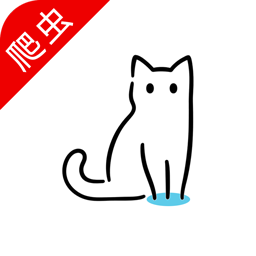

# 猫影视TV客户端爬虫自定义接口工程

```
思维没有边界 一切皆有可能
```
:rocket:[**TG交流群**](https://t.me/catvodtv_offical)

本工程最终食用需配合 猫影视TV新版（一下简称为软件） **v2.0.0**及以上版本。



### 欢迎各路大佬踊跃提PR，分享爬虫代码。

### 这里是用户分享的爬虫代码打包的共享包，可以配合自定义配置，直接食用 [custom_spider.jar](/jar/)

## 快速开始
----
本工程是一个完整的AndroidStudio工程，请你用AS打开编辑。 

工程调试完毕后要需要导出生成jar文件配合软件使用，执行根目录下的 `buildAndGenJar.bat` 会在`jar`目录生成一个名为`custom_spider.jar`的jar文件，这个文件就是我们最终要是用的代码包。

### 代码包食用方式
----
本地加载：将`custom_spider.jar`放入设备sd卡根目录即可。 **注意，如需本地加载，请手动赋予App存储空间读写权限，App默认不申请存储空间读写权限**

远程加载：将`custom_spider.jar`上传到你的网络空间，获取对应的文件下载地址，在软件自定义配置的json文件中加入下面格式的键值对。
```json 
"spider": "http://xxx.xxx.xxx/custom_spider.jar"
```
支持jar文件本地缓存（需v2.0.5及以上版本）
```json 
"spider": "http://xxx.xxx.xxx/custom_spider.jar;md5;jar文件md5"
// 例如
"spider": "https://github.com/catvod/CatVodTVSpider/blob/master/jar/custom_spider.jar?raw=true;md5;c6ed6bc8285f0aca90e7cb3abf7f9caa",
```

### 如何在自定义配置中调用我们代码包中的Spider
----
同样在自定义json中加入相应的播放源即可，**type=3, api对应你代码工程中自定义的爬虫类名（api必须是`csp_`开头），例如实例工程中的`Aidi`**
```json
{
    "key": "csp_Aidi",
    "name": "爱迪",
    "type": 3,
    "api": "csp_Aidi",
    "searchable": 1,
    "quickSearch": 0,
    "filterable": 1
}
```
---
**Json解析扩展（需v2.0.2及以上版本）**

通过jar包可以实现json解析并发、轮询等相关功能，**参与并发和轮询的json解析地址，默认为解析地址列表中的所有json解析（即type=1）**。

在自定义json中的`parse`里加入相应的解析配置（type=2）即可启用。**调用扩展类的名称配置在`parse`的`url`字段里，例如扩展类`JsonParallel`的json配置`url`字段值为`Parallel`**。如下：

```json
{
    "name": "Json并发",
    "type": 2,
    "url": "Parallel"
},
{
    "name": "Json轮询",
    "type": 2,
    "url": "Sequence"
}
```

**XPath规则套娃（需v2.0.4及以上版本）**
套娃规则祥见[XPath.md](/XPath.md)

---

**M浏览器中APP影视规则支持**（2022.01.17 by 小黄瓜）支持筛选。

因<a href="https://inmemory.coding.net/p/InMemory/d/MBrowser/git/raw/master/AppFile/APP%E5%BD%B1%E8%A7%86%E5%88%97%E8%A1%A8" target="_blank">App影视接口收集地址</a>停止维护，代码里不再读取相关json地址。

如果你有对应影视Api地址请在ext字段中直接配置Api地址。

<details>
<summary>配置代码示例 点我展开</summary>

```json
{"key":"csp_appysv2_追剧达人", "name":"追剧推荐(M2)", "type":3,"api":"csp_AppYsV2", "searchable":1, "quickSearch":0, "filterable":1, "ext":"https://vipmv.co/xgapp.php/v1/"},
{"key":"csp_appysv2_天空影视", "name":"天空推荐(M2)", "type":3,"api":"csp_AppYsV2", "searchable":1, "quickSearch":0, "filterable":1, "ext":"https://tkys.tv/xgapp.php/v1/"},
{"key":"csp_appys_HG影视", "name":"HG影视(M)", "type":3, "api":"csp_AppYs", "searchable":1, "quickSearch":0, "filterable":1, "ext":"http://hgyx.vip/api.php/v1.vod"},
{"key":"csp_appys_瑞丰资源", "name":"瑞丰资源(M)", "type":3, "api":"csp_AppYs", "searchable":1, "quickSearch":0, "filterable":1, "ext":"https://ts.yjhan.com:4433/ruifenglb_api.php/v1.vod"},
```
</details>

---

**部分内置代理接口使用（需v2.0.9及以上版本）**

入口 [Proxy](/app/src/main/java/com/github/catvod/spider/Proxy.java)

图片代理，示例参考[Nekk](/app/src/main/java/com/github/catvod/spider/Nekk.java#L449)

直播配置重定向代理，示例参考[TxtSubscribe](/app/src/main/java/com/github/catvod/live/TxtSubscribe.java)

---

**推送功能扩展（需v2.1.0.Beta6及以上版本）**

入口 [PushAgent](/app/src/main/java/com/github/catvod/spider/PushAgent.java)

需要在配置文件中，加入key为`push_agent`的站点，数据返回格式和普通爬虫一致

```json
{
  "key": "push_agent",
  "name": "推送",
  "type": 3,
  "api": "csp_PushAgent",
  "searchable": 0,
  "quickSearch": 0,
  "filterable": 0
}
```
---

## 基础类
----

> com.github.catvod.crawler.Spider 爬虫基类

> com.github.catvod.crawler.SpiderReq 用于发起网络请求 获取网络数据，请使用[OkHttpUtil](/app/src/main/java/com/github/catvod/utils/okhttp/OkHttpUtil.java)类，SpiderReq后续将删除

> com.github.catvod.crawler.SpiderReqResult 网络请求结果

> com.github.catvod.crawler.SpiderUrl 用于定义一个网络请求


## 示例
----

请查看 仓库中的爱迪影视 相关实现 ，调试可参考 `com.github.catvod.demo.MainActivity` ，直接调用对应爬虫相关接口

> com.github.catvod.spider.Aidi

## 注意事项!!
---- 
1. 除了`com.github.catvod.spider`包以外的代码，最终都会被软件本身内置的代码代替掉，所以，建议你不要修改除`com.github.catvod.spider`包以外的代码。

2. 不要在`Spider`中使用`Gson`

3. 待补充

## 爬虫类返回的相关Json字符串格式说明
----
### homeContent
```json
{
	"class": [{   // 分类
		"type_id": "dianying", // 分类id 
		"type_name": "电影" // 分类名
	}, {
		"type_id": "lianxuju",
		"type_name": "连续剧"
	}],
	"filters": { // 筛选
		"dianying": [{ // 分类id 就是上面class中的分类id
			"key": "0", // 筛选key
			"name": "分类", // 筛选名称
			"value": [{ // 筛选选项 
				"n": "全部", // 选项展示的名称
				"v": "dianying" // 选项最终在url中的展现
			}, {
				"n": "动作片",
				"v": "dongzuopian"
			}]
		}],
		"lianxuju": [{
			"key": 0,
			"name": "分类",
			"value": [{
				"n": "全部",
				"v": "lianxuju"
			}, {
				"n": "国产剧",
				"v": "guochanju"
			}, {
				"n": "港台剧",
				"v": "gangtaiju"
			}]
		}]
	},
	"list": [{ // 首页最近更新视频列表
		"vod_id": "1901", // 视频id
		"vod_name": "判决", // 视频名
		"vod_pic": "https:\/\/pic.imgdb.cn\/item\/614631e62ab3f51d918e9201.jpg", // 展示图片
		"vod_remarks": "6.8" // 视频信息 展示在 视频名上方
	}, {
		"vod_id": "1908",
		"vod_name": "移山的父亲",
		"vod_pic": "https:\/\/pic.imgdb.cn\/item\/6146fab82ab3f51d91c01af1.jpg",
		"vod_remarks": "6.7"
	}]
}
```

### categoryContent
```json
{
	"page": 1, // 当前页
	"pagecount": 2, // 总共几页
	"limit": 60, // 每页几条数据
	"total": 120, // 总共多少调数据
	"list": [{ // 视频列表 下面的视频结构 同上面homeContent中的
		"vod_id": "1897",
		"vod_name": "北区侦缉队",
		"vod_pic": "https:\/\/pic.imgdb.cn\/item\/6145d4b22ab3f51d91bd98b6.jpg",
		"vod_remarks": "7.3"
	}, {
		"vod_id": "1879",
		"vod_name": "浪客剑心 最终章 人诛篇",
		"vod_pic": "https:\/\/pic.imgdb.cn\/item\/60e3f37e5132923bf82ef95e.jpg",
		"vod_remarks": "8.0"
	}]
}
```

### detailContent
```json
{
	"list": [{
		"vod_id": "1902",
		"vod_name": "海岸村恰恰恰",
		"vod_pic": "https:\/\/pic.imgdb.cn\/item\/61463fd12ab3f51d91a0f44d.jpg",
		"type_name": "剧情",
		"vod_year": "2021",
		"vod_area": "韩国",
		"vod_remarks": "更新至第8集",
		"vod_actor": "申敏儿,金宣虎,李相二,孔敏晶,徐尚沅,禹美华,朴艺荣,李世亨,边胜泰,金贤佑,金英玉",
		"vod_director": "柳济元",
		"vod_content": "海岸村恰恰恰剧情:　　韩剧海岸村恰恰恰 갯마을 차차차改编自2004年的电影《我的百事通男友洪班长》，海岸村恰恰恰 갯마을 차차차讲述来自大都市的牙医（申敏儿 饰）到充满人情味的海岸村开设牙医诊所，那里住着一位各方面都",
        // 播放源 多个用$$$分隔
		"vod_play_from": "qiepian$$$yun3edu", 
        // 播放列表 注意分隔符 分别是 多个源$$$分隔，源中的剧集用#分隔，剧集的名称和地址用$分隔
		"vod_play_url": "第1集$1902-1-1#第2集$1902-1-2#第3集$1902-1-3#第4集$1902-1-4#第5集$1902-1-5#第6集$1902-1-6#第7集$1902-1-7#第8集$1902-1-8$$$第1集$1902-2-1#第2集$1902-2-2#第3集$1902-2-3#第4集$1902-2-4#第5集$1902-2-5#第6集$1902-2-6#第7集$1902-2-7#第8集$1902-2-8" 
	}]
}
```

### searchContent
```json
{
	"list": [{ // 视频列表 下面的视频结构 同上面homeContent中的
		"vod_id": "1606",
		"vod_name": "陪你一起长大",
		"vod_pic": "https:\/\/img.aidi.tv\/img\/upload\/vod\/20210417-1\/e27d4eb86f7cde375171dd324b2c19ae.jpg",
		"vod_remarks": "更新至第37集"
	}]
}
```


